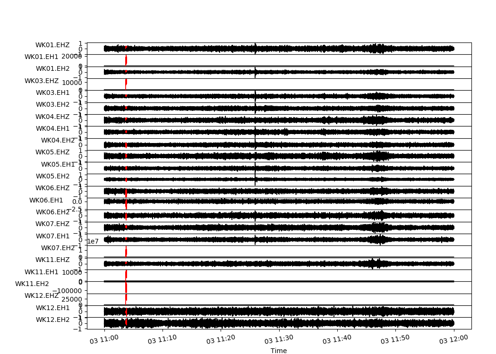

# geophsx-waveml
Project Objective: Repository for machine learning on automated S and P Wave detection 
Project Collaborators: [Andrew Growney](https://www.linkedin.com/in/andrewgrowney) and [Austin Irvine](https://www.linkedin.com/in/austinirvine)

## Description
With the goal to build an extensive machine learning platform for automated detection of earthquake's S and P wave detection, we utilized a fantastic cross-correlation based python library: [EQCorrscan](https://eqcorrscan.readthedocs.io/en/latest/).  
With the use of their tutorials, we worked with the KU Department of Geology's data to help them analyze their miniSeed files.
## Results

### Example: Multiplot Detection

## Project Notes
As we used the EQCorrscan library extensively, we had several notes that we wanted others to be aware of when using the library.  
1. Geology data often contains miniSeed files with many different file extension names. Do not count on consistent file extensions throughout different data sets. This is important to account for when extracting templates or data.
2. Use of terminology such as stream and trace can be ambiguous/interchangeable and you need to determine how you are using them as they are not.
3.

## Required Dependencies
asn1crypto==0.24.0,
basemap==1.2.0,
Bottleneck==1.2.1,
certifi==2018.11.29,
cffi==1.12.0,
chardet==3.0.4,
cryptography==2.5,
cycler==0.10.0,
decorator==4.3.2,
EQcorrscan==0.3.3,
future==0.17.1,
h5py==2.9.0,
idna==2.8,
kiwisolver==1.0.1,
lxml==4.3.1,
matplotlib==3.0.2,
mkl-fft==1.0.10,
mkl-random==1.0.2,
numpy==1.15.4,
obspy==1.1.0,
pandas==0.24.1,
pprint==0.1,
pycparser==2.19,
pyOpenSSL==19.0.0,
pyparsing==2.3.1,
pyproj==1.9.6,
pyshp==2.0.1,
PySocks==1.6.8,
python-dateutil==2.7.5,
pytz==2018.9,
requests==2.21.0,
scipy==1.2.0,
six==1.12.0,
SQLAlchemy==1.2.17,
tornado==5.1.1,
urllib3==1.24.1
