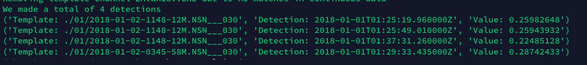
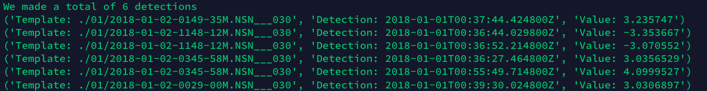
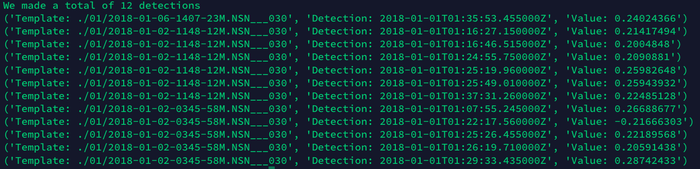

# geophsx-waveml
Repository for machine learning on automated S and P Wave detection

## Results

### Threshold Type: 'MAD' Threshold: 18.0

### Threshold Type: 'absolute' Threshold: 3.0

### Threshold Type: 'av_chan_corr' Threshold: 0.2

